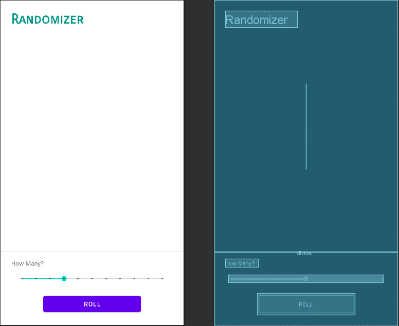

# Android-Randomizer
 An android app made in kotlin that randomizes based on a seek bar, which ranges from 1 - 10.

    

## Usage:
 Use this repo as source code, as a ready-to-paste. You can use it in Android studio. 